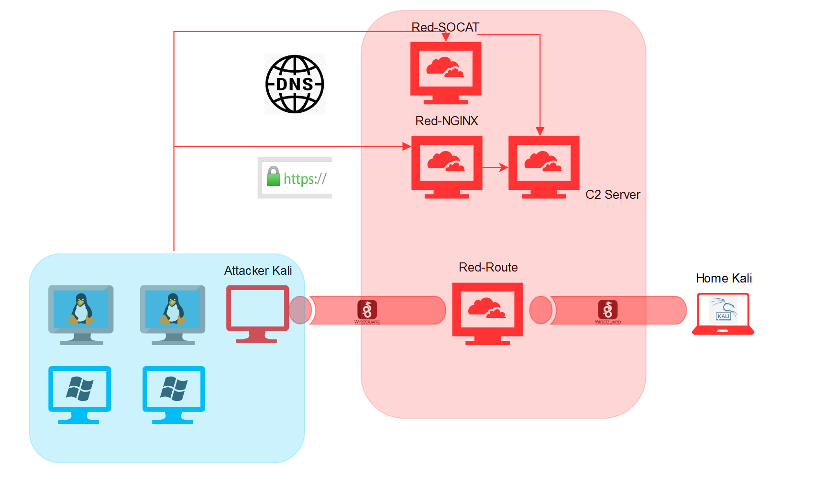

# MagicHats 

## Description
Penetration tests often require a lot of repeat work that can be easily automated.  Multiple solutions for infrasture as code (IaC) exist such as Terraform and Ansible.  By wrapping common options in a bash script I hope to add a bit of modularity for different deployment scenarios. All EC2 instances deployed are by default are Free Tier eligible to try and minimize costs.  If you really want to limit the amount of cost you can run the C2 server locally.

Current state of deployment does not utilize `mh.sh` and relies on Terraform configurations.  This is a temporary solution.

## Capabilities
- [x] Automatic AWS VPC Creation
- [x] Automatic AWS Subnet Creation
- [x] Automatic AWS Firewall Rule Creation
- [x] Socat Redirectors
- [x] Apache HTTP(S) Redirectors
	- [ ] Automate LetsEncrypt Registration
- [x] C2 Server Deployment
	- [x] Sliver
	- [ ] CobaltStrike
	- [ ] Wireguard Bastion (RedRoute)

## Requirements
- Ansible
- Terraform
- Python3
- AWS Account

## Installation

```
apt install terraform
#installs hashicorp/aws provider to manage EC2 instances
terraform init 
apt install ansible
```
Ansible requires Python3 to run so if you don't have that installed I believe it will pull it down for you.

```
git clone https://github.com/arokota/magichats
cd magichats
vi terraform.tfvars
```
Edit `terraform.tfvars` and fill in your AWS credentials and SSH keys

## Example Usage

Current implementation requires `instances.tf` to be edited to manually instruct what nodes you would like to deploy. To only deploy a single type of listener or exclude deploying a C2 server in the cloud then you simply need to comment that out.  (Also requires editing the `output.tf` file since it complains)

## Only Socat
(Default redirects port 80,443 -- very easy to change to 53 for dns shells :))
1. Create an AWS account and add a default SSH key for instances to be created with
2. Download Magichats and install using the instructions above
3. Edit `instances.tf` and `output.tf` and comment out Apache-Redirectors
	- Edit `/ansible/setup-sliver.yml` if you would like to have a different operator name than the default
4. Run `terraform apply` to deploy. 
	- Enter how many redirectors you want
	- Take note of `c2_ip` since you will need to reverse SSH port 31337 (default Sliver) to access
5. Ansible will dump `<your-operator-name>_localhost.cfg` to the project directory which will be your Sliver access profile. Use this to connect

## Only Apache
(Default redirects port 80,443)

By default Apache will use self-signed certifications. Current implementation does not automate letsencrypt but you can easily subsitute that if you would like.
Personally I prefer to put my DNS behind CloudFlare and use one of their certificates, letting my backend run raw HTTP through the Amazon VPC.  

1. Create an AWS account and add a default SSH key for instances to be created with
2. Download Magichats and install using the instructions above
3. Edit `instances.tf` and `output.tf` and comment out Socat-Redirectors
4. Edit `ansible/setup-apache.yml` and fill Apache Rewrite rules you would like.
5. Run `terraform apply` to deploy.  Take note of `c2_ip` since you will need to reverse SSH port 31337 (default Sliver) to access
	- Enter how many redirectors you want
	- Take note of `c2_ip` since you will need to reverse SSH port 31337 (default Sliver) to access
6. Ansible will dump `changeme_localhost.cfg` to the project directory which will be your Sliver access profile. Use this to connect

## Both Apache and Socat

Just don't edit anything out and start from step 5.



Diagram is a little out of date...will have to update that in the future but you get the idea.

## Future Work
* Modify primary workflow to work as follows:
	* Run `mh.sh` and answer prompts for what you want to deploy
	* Answers written to variables in a .tfvars file and Jinja2 templates for ansible
	* Terraform launched with the `--var-file="variables.tfvars" file
	* Profit

## Inspiration

A lot of these folk wrote really great blog posts that I definitely totally did not lift a couple of snippets here and there from (or whole files in some case).  Overall I think it's a great excercise to build this out yourself rather than just using someone elses deployment scripts. *Shakes fisk at Ansible*

- https://rastamouse.me/infrastructure-as-code-terraform-ansible/
- https://anubissec.github.io/Using-Ansible-and-Terraform-to-Build-Red-Team-Infrastructure/
- https://www.ired.team/offensive-security/red-team-infrastructure/automating-red-team-infrastructure-with-terraform
- https://github.com/tevora-threat/rt_redirectors
- Image Credit: https://www.deviantart.com/d4nt3wontdie/art/Magical-Hats-Magic-Artwork-760500482
